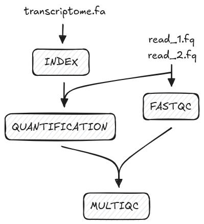

# 2.0 Introduction  

In this workshop, we will create a multi-sample Nextflow workflow for
preparing RNAseq data. We will build the workflow, step-by-step, by
converting a series of provided bash scripts into small workflow components.  

Along the way, you will encounter Nextflow concepts (from yesterday, and some
new) and best practices for developing your own pipeline.  

## 2.0.1 From bash scripts to scalable workflows  

Imagine you are a bioinformatician in a busy research lab. Your team will be
receiving a large batch of samples that need to be processed through a series
of analysis steps.  

You have inherited a set of bash scripts from a former colleague, which were
used to process a handful of samples manually. These scripts are robust
and well-tested, but they were not designed with scalability in mind.  

As more samples come in, running these scripts one by one is becoming
increasingly tedious and error-prone.  

**You need a way to automate this process, ensuring consistency and efficiency
across many samples.**  

You decide to use Nextflow.  

## 2.0.2 RNAseq: data and tools  

RNAseq is used to study gene expression and has many applications across
biomedicine, agriculture and evolutionary studies.  

**Data**  

The data we will use includes:
- `*.fastq`: Paired-end RNAseq reads from three different samples (gut, liver,
lung)
- `transcriptome.fa`  

**Tools**  

We will be implementing and integrating three commonly used bioinformatics
tools:  
1. [Salmon](https://combine-lab.github.io/salmon/) is a tool for quantifying molecules known as transcripts through RNA-seq data.  
2. [FastQC](https://www.bioinformatics.babraham.ac.uk/projects/fastqc/) is a tool for quality analysis of high throughput sequence data. You can think of it as a way to assess the quality of your data.  
3. [MultiQC](https://multiqc.info/) searches a given directory for analysis logs and compiles an HTML report for easy viewing. It's a general use tool, perfect for summarising the output from numerous bioinformatics tools.  

These tools will be run using Docker containers. We will not explore how the
data and tools work further, and focus on how they should be implemented in a
Nextflow workflow.  

## 2.0.3 Pipeline structure and design 



The workflow we will build has four processes (discrete steps):

1. `INDEX`
2. `FASTQC`
3. `QUANTIFICATION`
4. `MULTIQC`  

Each section in the workshop focuses on implementing one process at a time. We
will iteratively develop the workflow in a single `main.nf` file and lightly
use a `nextflow.config` file for configuration.

We will follow an ordered approach for each section building off the `process`
structure from Section 1.2:

```groovy
process < name > {
  [ directives ]

  input:
    < process inputs >

  output:
    < process outputs >

  script:
  """
  < script to be executed >
  """
}
```

Drawing upon the bash scripts for each process/section, the definitions will
be completed in the following order:  

1. `script`
2. `output`
3. `input`
4. `directives`
5. Adding to the `workflow` scope, any `params` and channels required  

!!! warning "Important"

    Ensure you `cd` into `hello-nextflow/day2` in the VSCode terminal.  

## 2.0.4 Advanced: `template-nf`  

Low barrier to developing workflows whilst adhering to best practices.

The workshop draws on _some_ of the concepts here.  

Should also provide a callout block that points to template-nf for more complex and modular workflow design.
