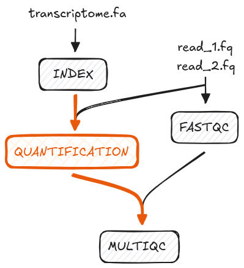

# 2.3 Multiple inputs  

!!! note "Learning objectives"

    1. Implement a process with multiple inputs. 
    2. Practice implementing a Nextflow process from a bash script.  
    3. Practice chaining Nextflow processes with channels.  
    4. Understand the components of a process such as `input`, `output`,
    `script`, `directive`, and the `workflow` scope.  

In this step you will have some hands-off practice with implementing a process
using the concepts and steps covered in the previous steps.  



You will implement the `02_quant.sh` bash script as a Nexflow process called
`QUANTIFICATION`.  

```bash title="02_quant.sh"
SAMPLE_ID=gut
READS_1="data/ggal/${SAMPLE_ID}_1.fq"
READS_2="data/ggal/${SAMPLE_ID}_2.fq"

salmon quant --libType=U -i results/salmon_index -1 ${READS_1} -2 ${READS_2} -o results/${SAMPLE_ID}
```

- `--libType=U` is a required argument. Leave this as is for the script definition.  
- `-i results/salmon_index` is the directory output by the `INDEX` process.  
- `-1` and `-2` are flags for the respective paired reads (`.fq`).  
- `-o` indicates that the command will output files into a directory called `results/gut`

!!! Tip

    Follow the same order of steps in implementing a process:  

        1. Start with the empty `process` scaffold.  
        2. Define the `script` based on the bash script `02_quant.sh`.  
        3. Identify and define the `output`(/s).  
        4. Identify and define the `input`(/s).  
        5. Define the `directive`s (`container`, `publishDir`).  
        6. Add the `workflow` scope and assign to a channel.  
        7. Create channels and input to the process.  

## 2.3.1 Implementing the process  

Here is the empty `process` template to get you started:  

```groovy title="main.nf"
process QUANTIFICATION {
  [ directives ]

  input:
    < process inputs >

  output:
    < process outputs >

  script:
  """
    < script to be executed >
  """
}
```

!!! question "Exercise"

    Add the `script` definition. Remember to convert hardcoded paths and bash
    variables to Nextflow `process` variables.  

    ??? note "Solution"

        ```groovy title="main.nf"
        process QUANTIFICATION {
          [ directives ]
        
          input:
            < process inputs >
        
          output:
            < process outputs >
        
          script:
          """
          salmon quant --libType=U -i $salmon_index -1 $reads_1 -2 $reads_2 -o $sample_id
          """
        }
        ```

!!! question "Exercise"

    Define the `output` definition.  

    ??? tip "Hint"  

        The `output` is a folder of `$sample_id`.

    ??? note "Solution"

        ```groovy title="main.nf"
        process QUANTIFICATION {
          [ directives ]
        
          input:
            < process inputs >
        
          output:
          path "$sample_id"
        
          script:
          """
          salmon quant --libType=U -i $salmon_index -1 $reads_1 -2 $reads_2 -o $sample_id
          """
        }
        ```

!!! question "Exercise"

    Define the process inputs for: `$salmon_index`, `$reads_1`, `$reads_2`, and
    `$sample_id`

    ??? tip "Hint"  

        Define `$sample_id`, `$reads_1`, and `$reads_2` as a tuple.
        Define `$salmon_index` as a separate input.  

    ??? note "Solution"

        ```groovy title="main.nf"
        process QUANTIFICATION {
          [ directives ]
        
          input:
          path salmon_index
          tuple val(sample_id), path(reads_1), path(reads_2)
        
          output:
          path "$sample_id"
        
          script:
          """
          salmon quant --libType=U -i $salmon_index -1 $reads_1 -2 $reads_2 -o $sample_id
          """
        }
        ```

!!! question "Exercise"

    Add the `container` and `publishDir` directives to the `QUANTIFICATION` process. The container is the same as the `INDEX` process.  

    ??? note "Solution"

        ```groovy title="main.nf"
        process QUANTIFICATION {
        
          container "quay.io/biocontainers/salmon:1.10.1--h7e5ed60_0"
          publishDir params.outdir, mode: 'copy'

          input:
          path salmon_index
          tuple val(sample_id), path(reads_1), path(reads_2)
        
          output:
          path "$sample_id"
        
          script:
          """
          salmon quant --libType=U -i $salmon_index -1 $reads_1 -2 $reads_2 -o $sample_id
          """
        }
        ```

## 2.3.3 Workflow scope 

!!! question "Exercise"

    Add `QUANTIFICATION` to the workflow scope, add the inputs, and assign it
    to a channel called `quant_ch`.  

    ??? note "Solution"

    ```groovy title="main.nf"
            fastq_ch = INDEX(params.transcriptome_file)
            quant_ch = QUANTIFICATION(index_ch, read_pairs_ch)
    }
    ```

Run the workflow:  
```bash
nextflow run main.nf -resume
```

> Update output

```console title="Output"
Launching `main.nf` [shrivelled_cuvier] DSL2 - revision: 4781bf6c41

executor >  local (2)
[35/05252c] INDEX              | 1 of 1 ✔
[dc/b8763a] FASTQC (1)         | 1 of 1 ✔
[e3/a9392n] QUANTIFICATION (1) | 1 of 1 ✔

```

!!! abstract "Summary"

    In this step you have learned:

        1. How to          
        1. How to 
        1. How to 
