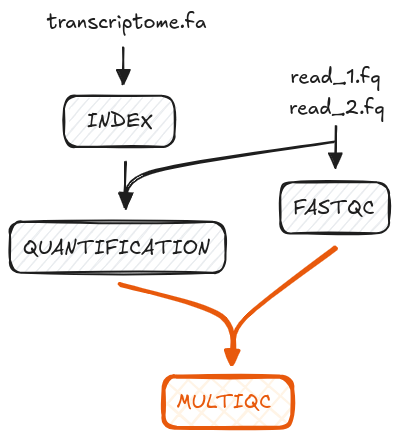

# 2.4 Combining channels and multiple process outputs  

!!! note "Learning objectives"  

    1. Implement a channel that combines the contents of two channels.  
    2. Implement a process with multiple output files.  

In this step we will add `03_multiqc.sh` to our workflow. MultiQC aggregates
results from all our analyses and renders it into a nice report. You can see an
example report [here](https://multiqc.info/examples/rna-seq/multiqc_report).

From the MultiQC [docs](https://multiqc.info/docs/):  

!!! note

    MultiQC doesn’t do any analysis for you - it just finds results from
    other tools that you have already run and generates nice reports.
    


```bash title="03_multiqc.sh"
multiqc --outdir results/ results/
```

`--outdir results/` indicates where to output two MultiQC files:  

1. A directory `multiqc_data` with files needed to generate the report
2. A file `multiqc_report.html` 

`results/` is the input argument and automatically searches for the output
files generated by the `FASTQC` and `QUANTIFICATION` processes.  

In this step we will change the order of implementation. We will first add the
channel in the workflow scope to help understand why the `input` and `script`
definitions for the `MULTIQC` process are the way they are.  

## 2.4.1 Combining channels with operators  

From the information above we know that the input for `multiqc` is the
`results/` directory. We will need to bring the outputs of the `FASTQC`
(`fastqc_gut_logs/`) and `QUANTIFICATION` (`gut/`) processes into a single channel as input to `MULTIQC`.  

!!! question "Exercise"

    Which channels output:

    1. `fastqc_gut_logs/`
    2. `gut/`

    ??? note "Solution"

        `fastqc_ch` and `quant_ch`.  

The next few steps will involve chaining together nextflow operators to prepare
the inputs for the correct format for the `MULTIQC` process.  

In the workflow scope, use the 
[`mix`](https://www.nextflow.io/docs/latest/operator.html#mix) operator to
emit the contents of `fastqc_ch` and `quant_ch` and view it:  

```groovy title="main.nf"
    fastqc_ch = FASTQC(read_pairs_ch)
    quant_ch = QUANTIFICATION(index_ch, read_pairs_ch)

    fastqc_ch
        .mix(quant_ch)
        .view()
}
```

Run the workflow:  

```bash
nextflow run main.nf -resume  
```

The output should look something like:  

```console title="Output"
Launching `main.nf` [hopeful_perlman] DSL2 - revision: c0603d2f16

[aa/3b8821] INDEX          | 1 of 1, cached: 1 ✔
[c2/baa069] QUANTIFICATION | 1 of 1, cached: 1 ✔
[ad/e49b20] FASTQC         | 1 of 1, cached: 1 ✔
/home/ubuntu/hello-nextflow/work/ad/e49b204c50c8f819dbddc4526010cf/fastqc_gut_logs
/home/ubuntu/hello-nextflow/work/c2/baa0691de7afccb3ed6d285947c8bf/gut

```  

The outputs have been emitted one after the other, meaning that it will be
processed separately. We need them to be processed together (generated in the
same report) so need one more step.  

Add the [`collect`](https://www.nextflow.io/docs/latest/operator.html#collect)
operator to ensure all samples are processed together in the same
process and view the output:  

```groovy title="main.nf"
    fastqc_ch = FASTQC(read_pairs_ch)

    quant_ch
        .mix(fastqc_ch)
        .collect()
        .view()
}
```

Run the workflow:  

```bash
nextflow run main.nf -resume  
```

The channel now outputs a single tuple with the two directories.  

```console title="Output"
Launching `main.nf` [cranky_booth] DSL2 - revision: 568fddbfec

[aa/3b8821] INDEX          | 1 of 1, cached: 1 ✔
[c2/baa069] QUANTIFICATION | 1 of 1, cached: 1 ✔
[ad/e49b20] FASTQC         | 1 of 1, cached: 1 ✔
[/home/temp/GitHub/hello-nextflow/work/ad/e49b204c50c8f819dbddc4526010cf/fastqc_gut_logs, /h
ome/temp/GitHub/hello-nextflow/work/c2/baa0691de7afccb3ed6d285947c8bf/gut]

```

!!! question "Exercise"

    Remove `.view()` and `set` the output as `all_qc_ch` 

    ??? note "Solution"
        
        ```groovy title="main.nf"
            quant_ch
                .mix(fastqc_ch)
                .collect()
                .set { all_qc_ch }
        }
        ```

## 2.4.1 Adding the `MULTIQC` process  

> According to pipeline
[integration recommendations](https://multiqc.info/docs/usage/pipelines/#nextflow)  

Add the following process definition with the `input`, `script`, and
`directives` included:  

```groovy title="main.nf"
process MULTIQC {

  container "quay.io/biocontainers/multiqc:1.19--pyhdfd78af_0"
  publishDir params.outdir, mode: 'copy'

  input:
  path "*"  

  output:
    < process outputs >

  script:
  """
  multiqc .
  """
}
```

> Refer back to staging from day 1, and that the channel/`.collect` deals
with this. More stable using channels to deal with paths vs. directory input

Add the output definition:  

```groovy title="main.nf"
process MULTIQC {
  [ directives ]

  input:
  path "*"  

  output:
  path "multiqc_report.html"
  path "multiqc_data"

  script:
  """
  multiqc .
  """
}
```

!!! question "Exercise"

    Add the workflow scope for `MULTIQC`. You do not need to assign this to a
    channel variable as this is the last process for the workflow.  

    ??? note "Solution"

```groovy title="main.nf"
    fastqc_ch
        .mix(quant_ch)
        .collect()
        .set { all_qc_ch }

    MULTIQC(all_qc_ch)
}
```

Run the workflow:  

```bash
nextflow run main.nf -resume  
```

```console title="Output"
Launching `main.nf` [hopeful_swanson] DSL2 - revision: a4304bbe73

[aa/3b8821] INDEX          [100%] 1 of 1, cached: 1 ✔
[c2/baa069] QUANTIFICATION [100%] 1 of 1, cached: 1 ✔
[ad/e49b20] FASTQC         [100%] 1 of 1, cached: 1 ✔
[a3/1f885c] MULTIQC        [100%] 1 of 1 ✔

```

> Inspect `results/multiqc_report.html`, maybe Poll something in the file  

You have a working pipeline for a single paired-end sample!

!!! abstract "Summary"

    1.  
